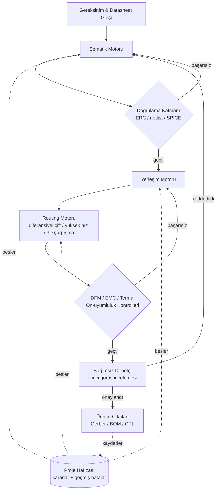

# Autonomous PCB Agent

> KiCad üzerinde donanım tasarımını gereksinimden şematiğe, yerleşime,
> routing'e ve üretime hazır çıktılara kadar uçtan uca yürüten,
> her fazı otomatik doğrulamadan geçiren yapay zeka tabanlı bir ajan.

**🔒 Bu depo bir portföy özetidir. Kaynak kodu private'dır — aşağıdaki
[Neden kapalı kaynak](#neden-kapalı-kaynak) bölümüne bakın.**

📬 İletişim: [ozkanayca8@gmail.com](mailto:ozkanayca8@gmail.com) · [LinkedIn](https://www.linkedin.com/in/ay%C3%A7a-%C3%B6zkan-0a2265195)
🗂 Canlı yol haritası: bu deponun **Projects** sekmesine bakın.

---

## İçindekiler
- [Türkçe](#genel-bakış) (ana bölüm)
- [English Summary](#english-summary)

---

## Genel Bakış

Bu proje, KiCad üzerinde uçtan uca baskılı devre kartı (PCB) tasarımı yapan
otonom bir ajan — gereksinim/bileşen analizinden şematik çizimine, PCB
yerleşimine, routing'e ve üretime hazır çıktılara kadar; her aşamada
elektriksel, mekanik, termal ve üretilebilirlik kurallarını, hatayı sona
bırakmak yerine adım adım zorunlu kılarak.

Proje, geleneksel olarak sıfır tolerans gerektiren bir alanda (yanlış bir
iz genişliği ya da yönlendirilmemiş bir diferansiyel çift, bir unit test'i
değil fiziksel bir kartı bozar) bir LLM tabanlı ajana ne kadar
güvenilebileceğini görmek amacıyla geliştirildi — bu da mimarinin büyük
kısmını şekillendirdi: **her faz, bağımsız ve otomatik bir doğrulama
adımıyla kapılanır**, ve ajan aynı hatayı oturumlar arasında tekrarlamamak
için geçmiş hatalarının kalıcı bir hafızasını tutar.

### Temel yetenekler

**Şematik fazı**
- Gereksinim analizi → datasheet tabanlı bileşen/pin analizi
- 4 aşamalı doğrulama hattına sahip otomatik şematik çizimi (pin eşleşme
  kontrolü, ERC, netlist karşılaştırma, ngspice köprüsü üzerinden SPICE
  simülasyonu)
- IPC-7351 uyumlu footprint üretimi

**Yerleşim ve routing fazı**
- Mekanik/açıklık kısıtlarına uyan kuvvet-yönelimli otomatik yerleşim
- Stackup ve kontrollü empedans planlama
- Yüksek hızlı sinyal "escape" routing'i ve diferansiyel çift routing'i
- 3D yol bulma ile çarpışma farkında routing
- Netclass doğrulama katmanına sahip otonom routing köprüsü (Freerouting
  entegrasyonu)

**Kesişen doğrulama ve uyumluluk**
- DFM (üretilebilirlik için tasarım) ve EMC ön-uyumluluk kontrolleri
- ECAD↔MCAD termal çapraz kontrol köprüsü
- Bir fazın kendi bildirdiği sonuca güvenmeden yeniden denetleyen bağımsız
  bir "ikinci görüş" denetçi rolü — kendinden bildirilen "bitti, sıfır
  hata" ifadesine asla güvenmez
- Kendi otomatik CLI'sı ve test paketine sahip üretim çıktısı üretimi
  (Gerber / BOM / CPL)

**Ajan altyapısı**
- Ajanın otonom olarak neyi değiştirebileceğini sınırlayan yönetilen bir
  "güvenli yazma" katmanı
- Kalıcı bir karar/hata hafızası: bir oturumda öğrenilen dersler kaydedilir
  ve bir sonraki oturumun başında danışılır, böylece bilinen hata
  kalıpları (araç tuhaflıkları, platform uyumsuzlukları, şema hataları)
  sıfırdan yeniden keşfedilmez
- Devam eden ajan çalışmasını ana tasarıma "promote" edilmeden önce
  incelemek için bir scratch/snapshot yönetim sistemi

### Mimari (soyutlanmış)

*(Diyagram yetenek seviyesindeki aşamaları gösterir, iç modül/dosya
yapısını göstermez.)*

### Durum / Yol Haritası

Sürekli güncellenen tam durum bu deponun **Projects** panosunda. Yayın
anındaki özet aşağıdadır:

| Durum | Yetenek |
|---|---|
| ✅ Tamamlandı | Şematik doğrulama hattı (pin eşleme, ERC, netlist, SPICE) |
| ✅ Tamamlandı | IPC-7351 footprint üretimi |
| ✅ Tamamlandı | Stackup ve kontrollü empedans planlama |
| ✅ Tamamlandı | Kuvvet-yönelimli otomatik yerleşim motoru |
| ✅ Tamamlandı | DFM / EMC ön-uyumluluk kontrolleri |
| ✅ Tamamlandı | Üretim çıktısı üretimi (Gerber/BOM/CPL) |
| ✅ Tamamlandı | Bağımsız ikinci-görüş doğrulama katmanı |
| ✅ Tamamlandı | Kalıcı proje hafızası / karar kaydı |
| 🚧 Devam ediyor | Diferansiyel çift routing |
| 🚧 Devam ediyor | 3D çarpışma farkında routing (A* yol bulma) |
| 🚧 Devam ediyor | Netclass doğrulama katmanı |
| 🚧 Devam ediyor | Genişletilmiş güvenli-yazma governance |
| 📋 Planlandı | Hata hafızasının otonom hatta otomatik bağlanması |
| 📋 Planlandı | Mevcut yetenek envanteri sonrası bir sonraki büyük faz |

**Test kapsamı:** 490 test; bilinen 32 test başarısızlığı Windows'a özgü,
koddan bağımsız bir ortam sorunundan kaynaklanıyor ve ayrı olarak takip
ediliyor (iç denetim, 2026-09-03 itibarıyla).

### Teknoloji yığını

Python · KiCad Python API (`pcbnew`) · ngspice (SPICE simülasyon köprüsü) ·
Freerouting (otonom routing motoru) · pytest (test odaklı geliştirme — her
modülün kendi test paketi var) · `uv` (bağımlılık/ortam yönetimi) ·
GitHub Actions (CI: sözdizimi kontrolleri, tam test paketi, smoke testleri)

### Örnek Çıktılar

<!-- TODO: aşağıdaki üç görsel türü seçildi, dosyalar henüz eklenmedi.
     `images/` klasörüne PNG/JPG eklenip referanslar güncellenecek.
     Kod içeren ekran görüntüsü konulmayacak. -->

- **PCB 3D render / gerber görseli** — `images/pcb-3d-render.png`
- **DRC/ERC rapor özeti (görsel)** — `images/drc-erc-ozet.png`
- **Terminal/CLI çıktı ekran görüntüsü** — `images/cli-output.png`

### Neden kapalı kaynak

Implementasyon private bir kod tabanı olarak sürdürülüyor. Bu depo, alttaki
mühendisliği yayınlamadan kapsam ve mevcut ilerleme hakkında doğru ve
dürüst bir tablo sunmak için var — kod incelemesi için yukarıdaki iletişim
üzerinden ulaşabilirsiniz.

---

## English Summary

An AI-driven agent that takes a PCB design end-to-end in KiCad — from
requirements/datasheet intake through schematic capture, placement,
routing, and manufacturing outputs — gating every phase behind an
independent, automated verification step (ERC, netlist diffing, SPICE,
DFM/EMC checks, a second-opinion auditor) and keeping a persistent memory
of past errors across sessions. Schematic verification, footprint
generation, auto-placement, DFM/EMC checks, manufacturing output
generation, and the second-opinion verification layer are done;
differential-pair routing, 3D collision-aware routing, netclass
validation, and expanded safe-write governance are in progress (490 tests;
32 known failures tied to a Windows-specific, code-independent environment
issue, tracked separately). Stack:
Python, the KiCad Python API, ngspice, Freerouting, pytest, `uv`, GitHub
Actions. The source code is private; this repository is a portfolio
summary only — see "Neden kapalı kaynak" above for why, or reach out via
the contact links above for a code walkthrough.
