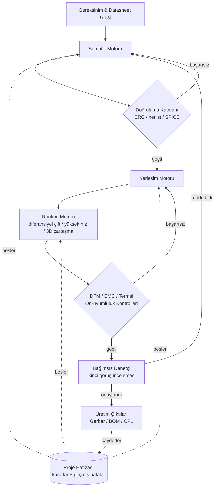

# Autonomous PCB Agent

> KiCad üzerinde donanım tasarımını gereksinimden şematiğe, yerleşime,
> routing'e ve üretime hazır çıktılara kadar uçtan uca yürüten,
> her fazı otomatik doğrulamadan geçiren yapay zeka tabanlı bir ajan.

**🔒 Bu depo bir portföy özetidir. Kaynak kodu private'dır — aşağıdaki
[Neden kapalı kaynak](#neden-kapalı-kaynak) bölümüne bakın.**

📬 İletişim: [ozkanayca8@gmail.com](mailto:ozkanayca8@gmail.com) · [LinkedIn](https://www.linkedin.com/in/ay%C3%A7a-%C3%B6zkan-0a2265195)
🗂 Canlı yol haritası: bu deponun **Projects** sekmesine bakın.

---

## İçindekiler
- [Türkçe](#genel-bakış) (ana bölüm)
- [English Summary](#english-summary)

---

## Genel Bakış

Bu proje, KiCad üzerinde uçtan uca baskılı devre kartı (PCB) tasarımı yapan
otonom bir ajan — gereksinim/bileşen analizinden şematik çizimine, PCB
yerleşimine, routing'e ve üretime hazır çıktılara kadar; her aşamada
elektriksel, mekanik, termal ve üretilebilirlik kurallarını, hatayı sona
bırakmak yerine adım adım zorunlu kılarak.

Proje, geleneksel olarak sıfır tolerans gerektiren bir alanda (yanlış bir
iz genişliği ya da yönlendirilmemiş bir diferansiyel çift, bir unit test'i
değil fiziksel bir kartı bozar) bir LLM tabanlı ajana ne kadar
güvenilebileceğini görmek amacıyla geliştirildi — bu da mimarinin büyük
kısmını şekillendirdi: **her faz, bağımsız ve otomatik bir doğrulama
adımıyla kapılanır**, ve ajan aynı hatayı oturumlar arasında tekrarlamamak
için geçmiş hatalarının kalıcı bir hafızasını tutar.

### Temel yetenekler

**Şematik fazı**
- Gereksinim analizi → datasheet tabanlı bileşen/pin analizi
- 4 aşamalı doğrulama hattına sahip otomatik şematik çizimi (pin eşleşme
  kontrolü, ERC, netlist karşılaştırma, ngspice köprüsü üzerinden SPICE
  simülasyonu)
- IPC-7351 uyumlu footprint üretimi

**Yerleşim ve routing fazı**
- Mekanik/açıklık kısıtlarına uyan kuvvet-yönelimli otomatik yerleşim
- Stackup ve kontrollü empedans planlama
- Yüksek hızlı sinyal "escape" routing'i ve diferansiyel çift routing'i
- 3D yol bulma ile çarpışma farkında routing
- Netclass doğrulama katmanına sahip otonom routing köprüsü (Freerouting
  entegrasyonu)

**Kesişen doğrulama ve uyumluluk**
- DFM (üretilebilirlik için tasarım) ve EMC ön-uyumluluk kontrolleri
- ECAD↔MCAD termal çapraz kontrol köprüsü
- Bir fazın kendi bildirdiği sonuca güvenmeden yeniden denetleyen bağımsız
  bir "ikinci görüş" denetçi rolü — kendinden bildirilen "bitti, sıfır
  hata" ifadesine asla güvenmez
- Kendi otomatik CLI'sı ve test paketine sahip üretim çıktısı üretimi
  (Gerber / BOM / CPL)

**Birleşik CLI, raporlama ve teslim (en yeni katman)**
- Tüm doğrulama/üretim araçlarını tek bir komut satırı arayüzünde toplayan
  birleşik CLI katmanı
- Tek bir ortak veri modelinden JSON + HTML + PDF olarak üretilen, iki
  dilli (TR/EN) birleşik tasarım-doğrulama raporu — DRC, ERC, mekanik
  anahat, güç bütünlüğü ve araç-bağlantı sağlığını tek başlık altında
  toplar
- Müşteri teslim paketleyicisi: git çalışma ağacı temizliği ve
  revizyon-etiket eşleşmesi gibi build kapıları + paket içeriğini tarayıp
  herhangi bir iç kaynak kodu/kimlik bilgisi izi bulursa **paketi
  otomatik olarak silen** zorunlu bir gizlilik taraması + SHA-256 tabanlı
  bütünlük manifestosu
- Kapalı-form empedans/pad-boyutu formüllerini bağımsız kaynaklara (KiCad'in
  kendi resmi footprint kütüphanesi dahil) karşı doğrulayan referans-değer
  test paketi, artı sabit bir kart geometrisine karşı regresyon yakalayan
  altın-standart (golden) test paketi

**Ajan altyapısı**
- Ajanın otonom olarak neyi değiştirebileceğini sınırlayan yönetilen bir
  "güvenli yazma" katmanı
- Kalıcı bir karar/hata hafızası: bir oturumda öğrenilen dersler kaydedilir
  ve bir sonraki oturumun başında danışılır, böylece bilinen hata
  kalıpları (araç tuhaflıkları, platform uyumsuzlukları, şema hataları)
  sıfırdan yeniden keşfedilmez
- Devam eden ajan çalışmasını ana tasarıma "promote" edilmeden önce
  incelemek için bir scratch/snapshot yönetim sistemi

### Mimari (soyutlanmış)

*(Diyagram yetenek seviyesindeki aşamaları gösterir, iç modül/dosya
yapısını göstermez.)*

### Durum / Yol Haritası

Sürekli güncellenen tam durum bu deponun **Projects** panosunda. Yayın
anındaki özet aşağıdadır:

| Durum | Yetenek |
|---|---|
| ✅ Tamamlandı | Şematik doğrulama hattı (pin eşleme, ERC, netlist, SPICE) |
| ✅ Tamamlandı | IPC-7351 footprint üretimi |
| ✅ Tamamlandı | Stackup ve kontrollü empedans planlama |
| ✅ Tamamlandı | Kuvvet-yönelimli otomatik yerleşim motoru |
| ✅ Tamamlandı | DFM / EMC ön-uyumluluk kontrolleri |
| ✅ Tamamlandı | Üretim çıktısı üretimi (Gerber/BOM/CPL) |
| ✅ Tamamlandı | Bağımsız ikinci-görüş doğrulama katmanı |
| ✅ Tamamlandı | Kalıcı proje hafızası / karar kaydı |
| ✅ Tamamlandı | Birleşik CLI (tüm doğrulama/üretim araçları tek arayüzde) |
| ✅ Tamamlandı | Çok formatlı (JSON/HTML/PDF), iki dilli birleşik doğrulama raporu |
| ✅ Tamamlandı | Zorunlu gizlilik taramalı müşteri teslim paketleyicisi |
| ✅ Tamamlandı | Bağımsız kaynaklara karşı doğrulanan empedans/pad referans testleri |
| ✅ Tamamlandı | Sabit kart geometrisine karşı regresyon (golden) test paketi |
| 🚧 Devam ediyor | Diferansiyel çift routing |
| 🚧 Devam ediyor | 3D çarpışma farkında routing (A* yol bulma) |
| 🚧 Devam ediyor | Netclass doğrulama katmanı |
| 🚧 Devam ediyor | Genişletilmiş güvenli-yazma governance |
| 📋 Planlandı | Hata hafızasının otonom hatta otomatik bağlanması |
| 📋 Planlandı | Mevcut yetenek envanteri sonrası bir sonraki büyük faz |

**Test kapsamı:** 3973 test (tam takım, iç denetim 2026-09-30) + birleşik
teslim-paketi katmanının 6 yeni testi (ayrıca doğrulandı) — sıfır bilinen
başarısızlık. Önceki 490 test/32 bilinen hata rakamı (2026-09-03) bu
oturumdaki genişletme ve iyileştirme çalışmasıyla güncellenmiştir.

### Teknoloji yığını

Python · KiCad Python API (`pcbnew`) · ngspice (SPICE simülasyon köprüsü) ·
Freerouting (otonom routing motoru) · pytest + `unittest` (test odaklı
geliştirme — her modülün kendi test paketi var) · Typer + Pydantic
(birleşik CLI ve yapılandırma doğrulama) · ReportLab (PDF rapor/teslim notu
üretimi) · `uv` (bağımlılık/ortam yönetimi) · GitHub Actions (CI: sözdizimi
kontrolleri, tip kontrolü, tam test paketi, gerçek KiCad Docker imajında
regresyon)

### Örnek Çıktılar

<!-- TODO: aşağıdaki üç görsel türü seçildi, dosyalar henüz eklenmedi.
     `images/` klasörüne PNG/JPG eklenip referanslar güncellenecek.
     Kod içeren ekran görüntüsü konulmayacak. -->

- **PCB 3D render / gerber görseli** — `images/pcb-3d-render.png`
- **DRC/ERC rapor özeti (görsel)** — `images/drc-erc-ozet.png`
- **Terminal/CLI çıktı ekran görüntüsü** — `images/cli-output.png`
- **Ajan çalışırken (demo GIF)** — `images/demo.gif`
- **Birleşik doğrulama raporu (HTML/PDF ekran görüntüsü)** — `images/rapor-ekrani.png`

### Vaka Çalışması: Akıllı Vampir-Güç Kesici Kart

<!-- TODO: bu bölüm bir ŞABLONdur. Hiçbir rakam/metrik UYDURULMADI - gerçek
     kart üretilip ölçülene kadar tüm sayısal alanlar bilerek BOŞ bırakıldı.
     Doldurulacak yerler [ ] içinde işaretli. -->

ESP32 tabanlı, şebekeden galvanik olarak izole edilmiş, röle üzerinden
yükü kesebilen bir "akıllı vampir-güç" kartı — bekleme modundaki (vampir)
güç tüketimini algılayıp otomatik olarak kesen bir cihaz. Ajanın uçtan uca
akışını (şematik → doğrulama → yerleşim → routing → DFM/EMC → bağımsız
denetim → üretim çıktısı) tek, somut bir donanım üzerinde göstermek için
seçildi.

**Tasarım kısıtları**
- Şebeke tarafı ile ESP32/kontrol tarafı arasında galvanik izolasyon
  (izolasyon mesafesi ve creepage/clearance IPC-2221'e göre doğrulanır)
- Röle sürücü devresi + geri-EMK koruması
- Güç tüketim ölçümü (akım/gerilim sensörü) ile gerçek zamanlı vampir-yük
  tespiti

**Sonuçlar** *(kart üretilip ölçülene kadar doldurulmayacak)*
- Toplam otonom iterasyon sayısı: `[ ]`
- Şematikten ilk DRC-temiz yerleşime kadar geçen süre: `[ ]`
- Bağımsız denetçinin yakaladığı, ajanın kendi raporunda görünmeyen bulgu
  sayısı: `[ ]`
- Üretilen kartın gerçek ölçüm sonuçları (izolasyon mesafesi, termal,
  vampir-yük algılama doğruluğu): `[ ]`

### Neden kapalı kaynak

Implementasyon private bir kod tabanı olarak sürdürülüyor. Bu depo, alttaki
mühendisliği yayınlamadan kapsam ve mevcut ilerleme hakkında doğru ve
dürüst bir tablo sunmak için var — kod incelemesi için yukarıdaki iletişim
üzerinden ulaşabilirsiniz.

---

## English Summary

An AI-driven agent that takes a PCB design end-to-end in KiCad — from
requirements/datasheet intake through schematic capture, placement,
routing, and manufacturing outputs — gating every phase behind an
independent, automated verification step (ERC, netlist diffing, SPICE,
DFM/EMC checks, a second-opinion auditor) and keeping a persistent memory
of past errors across sessions. On top of the design-flow engine, a
unified CLI layer now ties every validation/production tool into one
interface: a single-model, bilingual (TR/EN) validation report rendered as
JSON/HTML/PDF, and a customer delivery-package builder with build gates
(clean working tree, revision-tag match) plus a MANDATORY post-build
privacy scan that deletes the package outright if it finds any leaked
internal source or credential pattern. A reference-value test suite
validates the closed-form impedance/pad-size formulas against independent
sources (including KiCad's own official footprint library), and a golden
regression suite pins checker behaviour against fixed board geometry.

Schematic verification, footprint generation, auto-placement, DFM/EMC
checks, manufacturing output generation, the second-opinion verification
layer, the unified CLI/report/delivery layer, and the reference/golden
test suites are done; differential-pair routing, 3D collision-aware
routing, netclass validation, and expanded safe-write governance are in
progress (3973 full-suite tests plus 6 further tests for the delivery
layer, verified separately — zero known failures as of this update; the
previous "490 tests / 32 known failures" figure predates this round of
work). Stack: Python, the KiCad Python API, ngspice, Freerouting, pytest +
`unittest`, Typer + Pydantic (unified CLI/config), ReportLab (PDF
generation), `uv`, GitHub Actions (lint, type-check, full test suite, and
a real-KiCad-Docker regression job). The source code is private; this
repository is a portfolio summary only — see "Neden kapalı kaynak" above
for why, or reach out via the contact links above for a code walkthrough.

### Case Study: Smart Vampire-Power Cutoff Card

An ESP32-based, mains-isolated card that switches a load via relay — it
detects standby ("vampire") power draw and cuts it automatically. Chosen
to demonstrate the agent's full flow (schematic → verification → placement
→ routing → DFM/EMC → independent audit → manufacturing outputs) on one
concrete board. Constraints: galvanic isolation between the mains and
control sides (creepage/clearance checked against IPC-2221), a relay
driver with back-EMF protection, and real-time load sensing. **No numbers
are fabricated here** — iteration count, time-to-first-clean-layout,
auditor-caught-findings count, and the built board's own measurements
(isolation distance, thermal, detection accuracy) are left blank until a
real board exists to measure.
