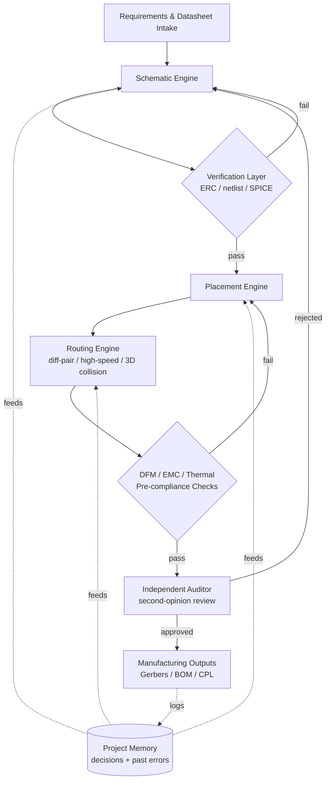

# Autonomous PCB Agent

> An AI-driven agent that takes a hardware design from requirements through
> schematic, layout, routing, and manufacturing outputs inside KiCad —
> with automated verification at every phase.

**🔒 This repository is a portfolio summary. The source code is private —
see [Why closed source](#why-closed-source) below.**

📬 Contact: `[add your email / LinkedIn here before publishing]`
🗂 Live roadmap: see the **Projects** tab on this repository.

---

## Table of Contents
- [English](#overview)
- [Türkçe](#genel-bakış)

---

## Overview

This project is an autonomous agent that designs printed circuit boards
end-to-end on top of KiCad — from component/requirements intake to
schematic capture, PCB placement, routing, and fabrication-ready outputs —
enforcing electrical, mechanical, thermal, and manufacturability rules at
every step instead of relying on a human catching mistakes at the end.

It was built to explore how far an LLM-driven agent can be trusted with a
domain that traditionally has zero tolerance for silent errors (a wrong
trace width or an unrouted differential pair fails a physical board, not a
unit test) — which shaped most of the architecture: **every phase is
gated by an independent, automated verification step**, and the agent
keeps a persistent memory of past mistakes so it does not repeat them
across sessions.

### Key capabilities

**Schematic phase**
- Requirement intake → datasheet-driven component/pin analysis
- Automated schematic capture with a 4-stage verification pipeline
  (pin-mapping cross-check, ERC, netlist diffing, SPICE simulation via an
  ngspice bridge)
- IPC-7351–compliant footprint generation

**Layout & routing phase**
- Force-directed automatic component placement with mechanical/clearance
  constraints
- Stackup and controlled-impedance planning
- High-speed signal "escape" routing and differential-pair routing
- Collision-aware routing with 3D pathfinding
- Autonomous routing bridge (Freerouting integration) with a netclass
  validation layer

**Cross-cutting verification & compliance**
- DFM (design-for-manufacturing) and EMC pre-compliance checks
- ECAD↔MCAD thermal cross-check bridge
- An independent "second opinion" auditor role that re-checks a phase's
  own claimed results before it's allowed to proceed — never trusts a
  self-reported "done, zero errors"
- Manufacturing output generation (Gerbers / BOM / CPL) with its own
  automated CLI + test suite

**Agent infrastructure**
- A governed "safe write" layer that gates what the agent is allowed to
  change autonomously
- A persistent decision/error memory: lessons learned in one session are
  logged and consulted at the start of the next, so known failure modes
  (tooling quirks, platform incompatibilities, schema mistakes) aren't
  re-discovered from scratch
- A scratch/snapshot governance system for reviewing agent work-in-progress
  before it's promoted into the main design

### Architecture (abstracted)

*(Diagram shows capability-level stages, not internal module/file
structure.)*

### Status / Roadmap

Full, continuously updated status lives on this repo's **Projects** board.
Summary as of publication:

| Status | Capability |
|---|---|
| ✅ Done | Schematic verification pipeline (pin-mapping, ERC, netlist, SPICE) |
| ✅ Done | IPC-7351 footprint generation |
| ✅ Done | Stackup & controlled-impedance planning |
| ✅ Done | Force-directed auto-placement engine |
| ✅ Done | DFM / EMC pre-compliance checks |
| ✅ Done | Manufacturing output generation (Gerbers/BOM/CPL) |
| ✅ Done | Independent second-opinion verification layer |
| ✅ Done | Persistent project memory / decision log |
| 🚧 In Progress | Differential-pair routing |
| 🚧 In Progress | 3D collision-aware routing (A* pathfinding) |
| 🚧 In Progress | Netclass validation layer |
| 🚧 In Progress | Expanded safe-write governance |
| 📋 Planned | Error-memory auto-wiring into the autonomous pipeline |
| 📋 Planned | Next major capability phase beyond current inventory milestone |

### Tech stack

Python · KiCad Python API (`pcbnew`) · ngspice (SPICE simulation bridge) ·
Freerouting (autonomous routing engine) · pytest (test-driven development —
every module ships with its own test suite) · `uv` (dependency/environment
management) · GitHub Actions (CI: syntax checks, full test suite, smoke
tests)

### Why closed source

The implementation is maintained as a private codebase. This repository
exists to give an accurate, honest picture of scope and current progress
without publishing the underlying engineering — for a code walkthrough,
please reach out via the contact above.

---

## Genel Bakış

Bu proje, KiCad üzerinde uçtan uca baskılı devre kartı (PCB) tasarımı yapan
otonom bir ajan — gereksinim/bileşen analizinden şematik çizimine, PCB
yerleşimine, routing'e ve üretime hazır çıktılara kadar; her aşamada
elektriksel, mekanik, termal ve üretilebilirlik kurallarını, hatayı sona
bırakmak yerine adım adım zorunlu kılarak.

Proje, geleneksel olarak sıfır tolerans gerektiren bir alanda (yanlış bir
iz genişliği ya da yönlendirilmemiş bir diferansiyel çift, bir unit test'i
değil fiziksel bir kartı bozar) bir LLM tabanlı ajana ne kadar
güvenilebileceğini görmek amacıyla geliştirildi — bu da mimarinin büyük
kısmını şekillendirdi: **her faz, bağımsız ve otomatik bir doğrulama
adımıyla kapılanır**, ve ajan aynı hatayı oturumlar arasında tekrarlamamak
için geçmiş hatalarının kalıcı bir hafızasını tutar.

### Temel yetenekler

**Şematik fazı**
- Gereksinim analizi → datasheet tabanlı bileşen/pin analizi
- 4 aşamalı doğrulama hattına sahip otomatik şematik çizimi (pin eşleşme
  kontrolü, ERC, netlist karşılaştırma, ngspice köprüsü üzerinden SPICE
  simülasyonu)
- IPC-7351 uyumlu footprint üretimi

**Yerleşim ve routing fazı**
- Mekanik/açıklık kısıtlarına uyan kuvvet-yönelimli otomatik yerleşim
- Stackup ve kontrollü empedans planlama
- Yüksek hızlı sinyal "escape" routing'i ve diferansiyel çift routing'i
- 3D yol bulma ile çarpışma farkında routing
- Netclass doğrulama katmanına sahip otonom routing köprüsü (Freerouting
  entegrasyonu)

**Kesişen doğrulama ve uyumluluk**
- DFM (üretilebilirlik için tasarım) ve EMC ön-uyumluluk kontrolleri
- ECAD↔MCAD termal çapraz kontrol köprüsü
- Bir fazın kendi bildirdiği sonuca güvenmeden yeniden denetleyen bağımsız
  bir "ikinci görüş" denetçi rolü — kendinden bildirilen "bitti, sıfır
  hata" ifadesine asla güvenmez
- Kendi otomatik CLI'sı ve test paketine sahip üretim çıktısı üretimi
  (Gerber / BOM / CPL)

**Ajan altyapısı**
- Ajanın otonom olarak neyi değiştirebileceğini sınırlayan yönetilen bir
  "güvenli yazma" katmanı
- Kalıcı bir karar/hata hafızası: bir oturumda öğrenilen dersler kaydedilir
  ve bir sonraki oturumun başında danışılır, böylece bilinen hata
  kalıpları (araç tuhaflıkları, platform uyumsuzlukları, şema hataları)
  sıfırdan yeniden keşfedilmez
- Devam eden ajan çalışmasını ana tasarıma "promote" edilmeden önce
  incelemek için bir scratch/snapshot yönetim sistemi

### Mimari (soyutlanmış)

Yukarıdaki İngilizce bölümdeki diyagrama bakınız — aşamalar yetenek
seviyesindedir, iç modül/dosya yapısını göstermez.

### Durum / Yol Haritası

Sürekli güncellenen tam durum bu deponun **Projects** panosunda. Yayın
anındaki özet için yukarıdaki İngilizce bölümdeki tabloya bakınız.

### Teknoloji yığını

Python · KiCad Python API (`pcbnew`) · ngspice (SPICE simülasyon köprüsü) ·
Freerouting (otonom routing motoru) · pytest (test odaklı geliştirme — her
modülün kendi test paketi var) · `uv` (bağımlılık/ortam yönetimi) ·
GitHub Actions (CI: sözdizimi kontrolleri, tam test paketi, smoke testleri)

### Neden kapalı kaynak

Implementasyon private bir kod tabanı olarak sürdürülüyor. Bu depo, alttaki
mühendisliği yayınlamadan kapsam ve mevcut ilerleme hakkında doğru ve
dürüst bir tablo sunmak için var — kod incelemesi için yukarıdaki iletişim
üzerinden ulaşabilirsiniz.

---

© 2026 Ayça Özkan — All rights reserved. This repository is a portfolio
summary; the underlying source code is proprietary and not included here.
